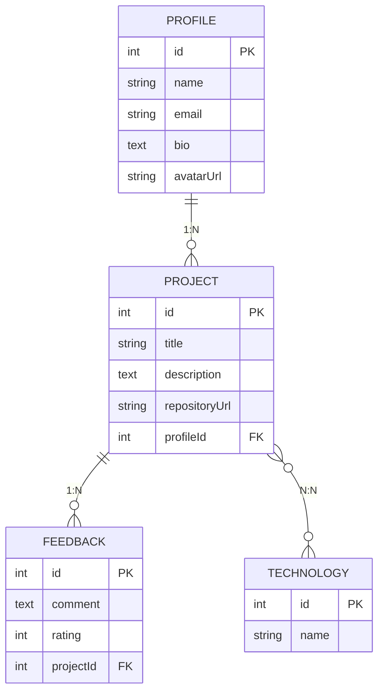
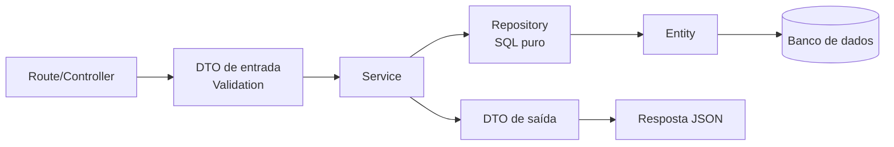

# DevShowcase API

Backend da plataforma **DevShowcase**.

> **Etapa 1 do projeto prático:** modelagem de domínio, persistência relacional e endpoints básicos.

## Contexto acadêmico

| Item | Detalhe |
|---|---|
| Instituição | Universidade Aberta do Brasil (UAB) / UESPI |
| Curso | Tecnologia em Sistemas para Internet |
| Disciplina | Backend |
| Atividade | Modelagem de domínio, persistência e endpoints básicos |


**Objetivo da atividade:** nesta primeira etapa do projeto prático, dar início ao desenvolvimento do backend da plataforma DevShowcase API, implementando a fundação arquitetural da aplicação com suporte a persistência de dados relacional.

**Requisitos técnicos entregues:**
1. Projeto Python 3.12+ estruturado com Flask, repositório git público e `.gitignore` adequado.
2. Modelagem das entidades `Profile`, `Project`, `Technology` e `Feedback`, com os relacionamentos `Profile 1:N Project`, `Project N:N Technology` e `Project 1:N Feedback`.
3. Repositórios de persistência (SQL puro via `psycopg2`/`sqlite3`) e DTOs de entrada (com validação de campos obrigatórios e URLs) e de saída.
4. Endpoints REST implementados e testados: `POST/GET /api/profiles`, `POST/GET /api/technologies` e `POST/GET /api/projects`.

## Sumário

- [Contexto acadêmico](#contexto-acadêmico)
- [Stack tecnológica](#stack-tecnológica)
- [Modelagem de domínio](#modelagem-de-domínio)
- [Arquitetura do projeto](#arquitetura-do-projeto)
- [Pré-requisitos](#pré-requisitos)
- [Como rodar localmente](#como-rodar-localmente)
- [Roteiro de apresentação (demo ao vivo)](#roteiro-de-apresentação-demo-ao-vivo)
- [Endpoints da API](#endpoints-da-api)
- [Testes automatizados](#testes-automatizados)
- [Solução de problemas](#solução-de-problemas)
- [Próximas etapas](#próximas-etapas)

## Stack tecnológica

| Camada          | Tecnologia                                    |
|-----------------|------------------------------------------------|
| Runtime         | Python 3.12+ (imagem `python:3.12-slim` no Docker) |
| Framework HTTP  | Flask 3                                        |
| Persistência    | `psycopg2` / `sqlite3` — SQL puro, sem ORM     |
| Banco de dados  | PostgreSQL (runtime/dev) · SQLite em memória (testes) |
| Containers      | Docker + Docker Compose                        |
| Configuração    | `python-dotenv` (variáveis via `.env`)         |
| Testes          | Pytest                                         |
| Build/deps      | pip + `requirements.txt`                       |

## Modelagem de domínio

4 entidades e 3 relacionamentos, conforme exigido na especificação:



- **Profile 1:N Project** — um perfil possui vários projetos.
- **Project N:N Technology** — um projeto usa várias tecnologias, e uma tecnologia aparece em vários projetos (tabela de junção `project_technologies`).
- **Project 1:N Feedback** — um projeto recebe vários feedbacks.

## Arquitetura do projeto

Fluxo de uma requisição, camada por camada:



```
app/
  __init__.py             # create_app(db): monta a app Flask (rotas, middlewares, error handlers)
  config/
    database.py            # Conexão (psycopg2 ou sqlite3)
    schema.py                # Cria as tabelas se não existirem
  routes.py                  # Endpoints REST (Profile, Project, Technology, Root) + painel web ("/")
  templates/
    index.html                # Painel HTML com formulários (perfil, tecnologia, projeto)
  dto/
    requests.py               # DTOs de entrada com validação
    responses.py               # DTOs de saída
  entities.py                  # Entidades de domínio (Profile, Project, Technology, Feedback)
  exceptions.py                 # Exceções customizadas
  errors.py                      # Tradução de exceções em respostas JSON
  middleware/
    cors.py                       # CORS
  repositories/                   # Acesso a dados via SQL puro
  services/                        # Regras de negócio de cada domínio
  validation/
    validator.py                    # Validador genérico
run.py                     # Front controller (carrega .env, abre conexão, sobe o servidor)
tests/                      # Testes de integração (Pytest)
scripts/
  init-multiple-databases.sh  # Cria os bancos dev/test no container do PostgreSQL
requirements.txt              # Dependências de runtime
requirements-dev.txt           # Dependências de runtime + testes
Dockerfile                 # Build da imagem Python 3.12-slim
docker-compose.yml          # Sobe API + PostgreSQL localmente
```

## Pré-requisitos

- Python 3.12+ e `pip` instalados — necessário apenas para rodar sem Docker.
- Uma instância PostgreSQL acessível (local ou remota) e sua connection string — ou Docker + Docker Compose para subir tudo localmente.

## Como rodar localmente

### Opção A — Docker Compose (recomendado)

Sobe a API e o PostgreSQL juntos, sem precisar instalar Python ou Postgres na máquina:

```bash
git clone <url-do-seu-repositorio>
cd devshowcase_python_atv1
docker compose up --build
```

A API fica disponível em `http://localhost:3589` e o PostgreSQL em `localhost:5434` (usuário/senha `postgres`, bancos `devshowcase` e `devshowcase_test`). Para rodar em segundo plano, use `docker compose up --build -d`; para parar, `docker compose down` (adicione `-v` para apagar também o volume de dados).

### Opção B — Python local (sem Docker)

Requer apenas uma instância PostgreSQL acessível (pode ser subida isoladamente com `docker compose up -d postgres`):

```bash
git clone <url-do-seu-repositorio>
cd devshowcase_python_atv1
python -m venv .venv
.venv\Scripts\activate  # Linux/Mac: source .venv/bin/activate
pip install -r requirements.txt
cp .env.example .env
# edite o .env se necessário (DB_HOST, DB_PORT, DB_DATABASE, DB_USERNAME, DB_PASSWORD)
python run.py
```

Isso executa o servidor de desenvolvimento do Flask em `0.0.0.0:3589`. As tabelas são criadas automaticamente na primeira requisição, via `Schema.ensure()`.

## Roteiro de apresentação (demo ao vivo)

Para demonstrar a API funcionando, use **dois terminais**:

**Terminal 1 — sobe o servidor e deixe rodando:**
```bash
docker compose up --build
# ou, sem Docker: python run.py
```

**Terminal 2 — executa a demonstração dos endpoints via `curl`:**

1. **Profiles** — `POST /api/profiles` (cria) e `GET /api/profiles/{id}` (busca, com `projects: []`)
2. **Technologies** — `POST /api/technologies` (cria) e `GET /api/technologies` (lista)
3. **Projects** — `POST /api/projects` (cria vinculando o profile e a technology criados) e `GET /api/projects` (lista)
4. **Relacionamento Profile 1:N Project** — repete `GET /api/profiles/{id}`, agora mostrando o projeto já vinculado em `projects`
5. **Validação de DTOs** — exemplos de erro `400` (perfil sem `name`/com `email` inválido; projeto com `title` vazio, `repositoryUrl` inválida ou `profileId` inexistente)

Os comandos `curl` prontos para cada passo estão na seção [Testando manualmente com `curl`](#endpoints-da-api) abaixo. Use e-mails/nomes diferentes a cada execução para evitar erro `409` de duplicidade — ideal para repetir a demonstração ao vivo.

## Endpoints da API

| Método | Rota                     | Descrição                              |
|--------|--------------------------|------------------------------------------|
| GET    | `/api`                   | Healthcheck / rota raiz da API             |
| POST   | `/api/profiles`          | Cadastra um perfil de desenvolvedor       |
| GET    | `/api/profiles/{id}`     | Busca um perfil por id                    |
| POST   | `/api/technologies`      | Cadastra uma tecnologia                   |
| GET    | `/api/technologies`      | Lista todas as tecnologias                |
| POST   | `/api/projects`          | Cadastra um projeto                       |
| GET    | `/api/projects`          | Lista projetos (`?profileId=` opcional)   |

### Painel web (opção mais fácil para cadastrar dados)

Além dos exemplos com `curl` abaixo, a própria API serve um painel HTML simples em [http://localhost:3589/](http://localhost:3589/), com formulários para cadastrar perfil, tecnologia e projeto direto pelo navegador — sem precisar de `curl` nem do console do DevTools. Cada formulário mostra o status HTTP e o JSON de resposta logo abaixo.

Fluxo sugerido: cadastre um **perfil**, depois uma **tecnologia**, anote os `id`s retornados e use-os para cadastrar um **projeto** (campos `Profile ID` e `Technology IDs`).

### Endpoints REST implementados e testados

Todos testados localmente contra `http://localhost:3589` (suba a API antes, via `docker compose up --build` ou `python run.py`). Os `GET` são clicáveis direto no navegador; os `POST` podem ser feitos pelo [painel web](#painel-web-opção-mais-fácil-para-cadastrar-dados) acima, via `curl`, ou pelo `fetch` do DevTools (veja [Testando pelo navegador](#testando-pelo-navegador)).

- **`POST /api/profiles`** — Cadastro de perfil com validações.
  ```bash
  curl -X POST http://localhost:3589/api/profiles \
    -H "Content-Type: application/json" \
    -d '{"name":"Flavio Rocha","email":"flavio@example.com"}'
  ```
- **`GET /api/profiles/{id}`** — Buscar perfil por id.
  [http://localhost:3589/api/profiles/1](http://localhost:3589/api/profiles/1)
- **`POST /api/technologies`** — Cadastro de tecnologia com validações.
  ```bash
  curl -X POST http://localhost:3589/api/technologies \
    -H "Content-Type: application/json" -d '{"name":"Python"}'
  ```
- **`GET /api/technologies`** — Listagem de todas as tecnologias.
  [http://localhost:3589/api/technologies](http://localhost:3589/api/technologies)
- **`POST /api/projects`** — Cadastro de projeto com validações.
  ```bash
  curl -X POST http://localhost:3589/api/projects \
    -H "Content-Type: application/json" \
    -d '{"title":"DevShowcase API","repositoryUrl":"https://github.com/flavio/devshowcase","profileId":1,"technologyIds":[1]}'
  ```
- **`GET /api/projects`** — Listagem de projetos.
  [http://localhost:3589/api/projects](http://localhost:3589/api/projects)

### Profiles

**POST /api/profiles**
```json
{
  "name": "Flavio Rocha",
  "email": "flavio@example.com",
  "bio": "Dev backend apaixonado por APIs",
  "avatarUrl": "https://example.com/flavio.png"
}
```
Validações: `name` obrigatório e não vazio · `email` obrigatório, formato válido e único · `avatarUrl` opcional, deve ser URL válida.

**GET /api/profiles/{id}** — retorna o perfil com a lista de projetos vinculados (404 se não existir).

### Technologies

**POST /api/technologies**
```json
{ "name": "Python" }
```
Validações: `name` obrigatório, não vazio e único (409 se duplicado).

**GET /api/technologies** — lista todas as tecnologias, ordenadas por nome.

### Projects

**POST /api/projects**
```json
{
  "title": "DevShowcase API",
  "description": "Backend do projeto",
  "repositoryUrl": "https://github.com/flavio/devshowcase",
  "profileId": 1,
  "technologyIds": [1, 2]
}
```
Validações: `title` obrigatório e não vazio · `repositoryUrl` obrigatória e deve ser URL válida · `profileId` obrigatório e deve referenciar um Profile existente · `technologyIds` opcional, deve referenciar Technologies existentes.

**GET /api/projects** — lista todos os projetos, aceita `?profileId=` para filtrar por perfil.

### Testando manualmente com `curl`

```bash
# Criar perfil
curl -X POST http://localhost:3589/api/profiles \
  -H "Content-Type: application/json" \
  -d '{"name":"Flavio Rocha","email":"flavio@example.com"}'

# Buscar perfil
curl http://localhost:3589/api/profiles/1

# Criar tecnologia
curl -X POST http://localhost:3589/api/technologies \
  -H "Content-Type: application/json" -d '{"name":"Python"}'

# Listar tecnologias
curl http://localhost:3589/api/technologies

# Criar projeto
curl -X POST http://localhost:3589/api/projects \
  -H "Content-Type: application/json" \
  -d '{"title":"DevShowcase API","repositoryUrl":"https://github.com/flavio/devshowcase","profileId":1,"technologyIds":[1]}'

# Listar projetos
curl http://localhost:3589/api/projects

# Buscar perfil inexistente (demonstra erro 404)
curl -i http://localhost:3589/api/profiles/9999
```

### Testando pelo navegador

A barra de endereço do navegador só faz requisições `GET`, então funciona diretamente para:
- [http://localhost:3589/api/profiles/1](http://localhost:3589/api/profiles/1)
- [http://localhost:3589/api/technologies](http://localhost:3589/api/technologies)
- [http://localhost:3589/api/projects](http://localhost:3589/api/projects)
- [http://localhost:3589/api/profiles/9999](http://localhost:3589/api/profiles/9999) — perfil inexistente, demonstra o erro `404` (`{"message":"Perfil não encontrado."}`)

> Cuidado ao copiar essas URLs de um texto corrido: um ponto final de frase colado no fim da URL (ex.: `.../api/technologies.`) faz a rota não ser encontrada (404).

Para testar os endpoints `POST` pelo navegador, abra o **DevTools (F12) → Console** e rode `fetch`:

```js
fetch('http://localhost:3589/api/technologies', {
  method: 'POST',
  headers: { 'Content-Type': 'application/json' },
  body: JSON.stringify({ name: 'Python' }),
}).then((r) => r.json()).then(console.log);
```

## Testes automatizados

Testes de integração (Pytest, via `Flask test client`) cobrem os endpoints de `Profile`, `Technology` e `Project`, incluindo casos de sucesso, validação e erro (404/409), em 3 arquivos (`test_profile_controller.py`, `test_technology_controller.py`, `test_project_controller.py`).

Os testes rodam contra um banco SQLite em memória (veja `tests/conftest.py`), isolado do banco de desenvolvimento, sem precisar de Postgres rodando:

```bash
pip install -r requirements-dev.txt
python -m pytest
```

> Prefira `python -m pytest` a `pytest` puro: se o Python não estiver num virtualenv ativado, o executável `pytest` pode ficar numa pasta (`Scripts`/`bin` da instalação por usuário) que não está no `PATH`, resultando em `comando não reconhecido`. `python -m pytest` sempre funciona, pois usa o pacote já instalado no interpretador atual.

## Solução de problemas

| Sintoma | Causa provável | Solução |
|---|---|---|
| `ModuleNotFoundError: No module named 'psycopg2'` | Dependências não instaladas | Rode `pip install -r requirements.txt` (ou `requirements-dev.txt` para incluir o Pytest) |
| `psycopg2.OperationalError: could not connect to server... port 5434` | PostgreSQL não está rodando ou porta incorreta | Suba o banco com `docker compose up -d postgres` (ou instância local equivalente) e confira `DB_PORT` no `.env` |
| Erro de conexão com o banco ao subir a API | `.env` ausente ou variáveis `DB_*` incorretas | `cp .env.example .env` e ajuste `DB_HOST`/`DB_PORT`/`DB_DATABASE`/`DB_USERNAME`/`DB_PASSWORD` |
| `GET /api/technologies` ou `/api/projects` retornam `[]` | Banco recém-criado, sem registros | Normal em um banco novo; cadastre dados via `POST` (veja os exemplos de `curl` acima) |
| `404 Not Found` em uma rota que deveria existir | Ponto final de frase colado no fim da URL, ou rota digitada errada | Confira a URL exata (sem `.` extra no final) contra a tabela de [Endpoints da API](#endpoints-da-api) |
| Porta `3589` já em uso | Outro processo/serviço ocupando a porta | Altere `APP_PORT` no `.env` (e em `docker-compose.yml`, se necessário) |
| `pytest : O termo 'pytest' não é reconhecido...` (PowerShell) | `pytest.exe` não está no `PATH` (comum sem virtualenv ativado) | Rode `python -m pytest` no lugar de `pytest`, ou crie/ative um virtualenv (`python -m venv .venv` + `.venv\Scripts\activate`) antes de instalar as dependências |

## Próximas etapas

- Endpoint de `Feedback` (`Project 1:N Feedback`), ainda modelado mas sem rotas/controller dedicados.
- Paginação e filtros adicionais em `GET /api/projects` e `GET /api/technologies`.
- Autenticação/autorização para os endpoints de escrita.
- Deploy da imagem Docker em um ambiente gerenciado (ex.: Render, Railway, AKS).
